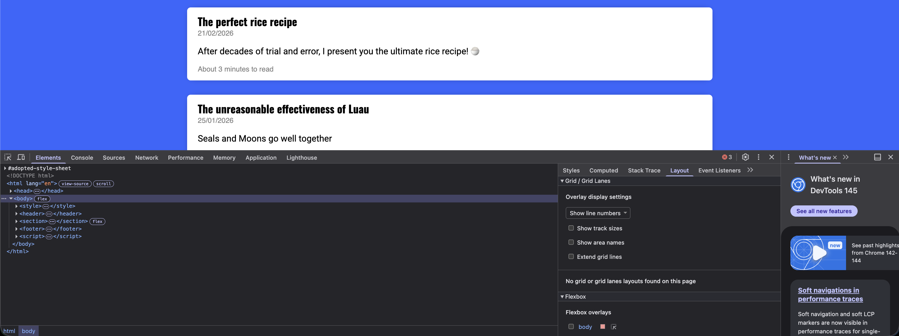
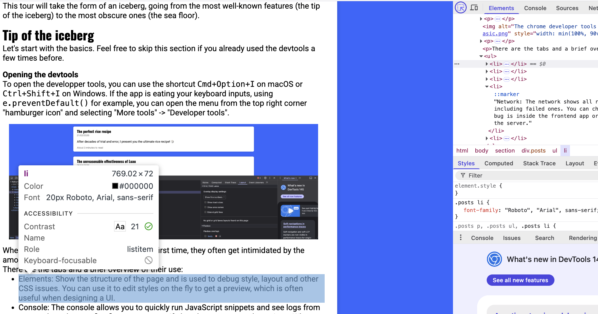
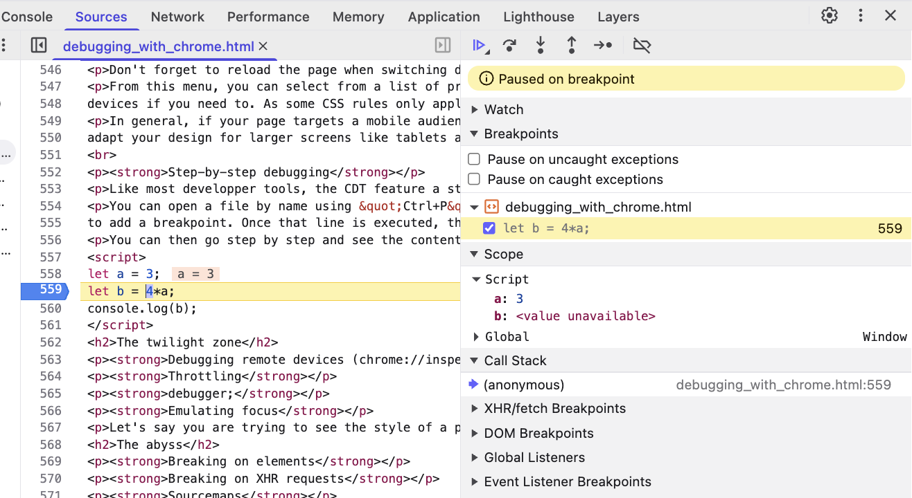
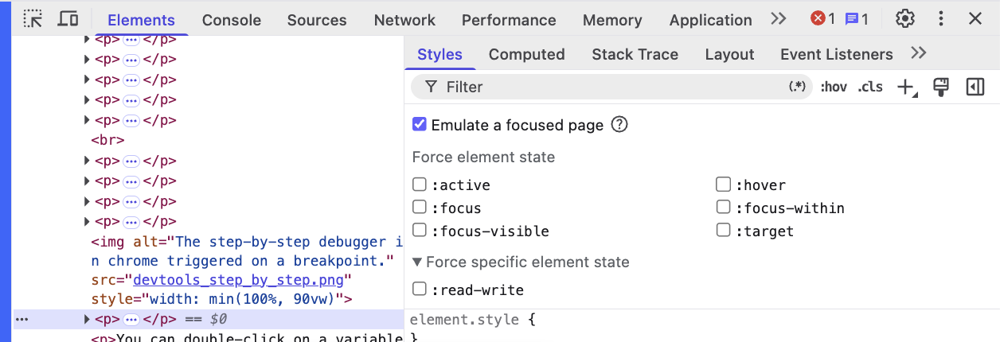



# Debugging with the Chrome Developer Tools

*A guided tour of the best debugger you didn't know existed*

<br>

If you are a developer or just a regular chrome browser user, you probably know that your browser has "developer tools", also known as the chrome devtools, or chrome inspect, a panel that opens below the page by default and allows you to inspect and debug a webpage.

<br>

However, what you might not know is that the Chrome Developer Tools (CDT) are one, if not the best debugging tools of all of programming and
are one of the reason that lead to JavaScript's dominance. Having used a lot of IDE with debuggers like IntelliJ, VSCode, Visual Studio Code and XCode,
I must say that when it comes to building UIs, debugging with the CDT (Chrome Developer Tools) is an experience that is hard to beat in terms of DevX.

<br>

So, let's take a tour of the devtools together, from most common / well-known feature to least known (in my humble opinion),
while providing tools that are useful no matter your frontend project. Whever you are working on a large-ish (maybe about 100 000 lines of code) JavaScript app with no framework and you are trying to understand parts of the app or if you are working on a React or Vue app with TypeScript and components and popular libraries like Redux for state management.

This tour will take the form of an iceberg, going from the most well-known features (the tip of the iceberg) to the most obscure ones (the sea floor).

## Tip of the iceberg

Let's start with the basics. Feel free to skip this section if you already used the devtools a few times before.

<br>

**Opening the devtools**

To open the developer tools, you can use the shortcut `Cmd+Option+I` on macOS or `Ctrl+Shift+I` on Windows.
If the app is eating your keyboard inputs, using `e.preventDefault()` for example, you can open the menu from the top right corner "hamburger icon" and
selecting "More tools" -> "Developer tools".



When most people see the devtools for the first time, they often get intimidated by the amount of tabs and options.

There are the tabs and a brief overview of their use:

- Elements: Show the structure of the page and is used to debug style, layout and other CSS issues. You can use it to edit styles on the fly to get a preview, which is often useful when designing a UI.
- Console: The console allows you to quickly run JavaScript snippets and see logs from your code and `console.log` statements. If also shows errors and warnings. When something is not working as expected, this is the first place to look.
- Source: This tab lists all of the files loaded to show the web page and is home to the step-by-step debugger.
- Network: The network shows all requests made by your browser when displaying the page, including failed ones. You can check here is something is not loading or to check if the bug is inside the frontend app or if the cause of your issue is incorrect data sent by the server.
- Application: This tab contains extra information about the state of your app including cookies, local storage and other data which persist between reloads.

<br>

The other tabs are less commonly used and have more specific use-cases. Note that you also have secret 'extra' tabs that you can access by clicking on the three dots icon and in "More tools", but we'll get into these later.

<br>

**Elements**

The Elements tab show you the current HTML structure of the page. This is the tab you use when designing pages and understanding why a page looks the way it does.

You can click on the little arrow at the top and hover over an element on the page to see what HTML is defining it and what properties it has.



We can see both what elements are above and below this one, but also what style properties the element has in the "Styles" panel, for example, its font.
We can also see why the element has this font: in what CSS file is the rule `.posts p` defined.

You can go to the computed tab to see what properties the element actually has and click on one to see the reason for why it has this property. This can be useful
when there are a lot of CSS rules overriding one another on one element. It also shows you how size, padding, border and margin on this element effect its layout.

<br>

**Console**

The console allows you to evaluate JavaScript expression in the global context of the page.

For example, you can find all `.posts p` elements on the page by running `document.querySelectorAll(".posts p")`.
This can be useful for testing selectors for scraping a page.

You can also use the console to quickly run some JavaScript, if you forgot some syntax, or if you want to get the current epoch `new Date().getTime() / 1000` for example.

> Tip: If you selected an element inside *Elements*, you can refer to it using `$0`, to its parent using `$1`, to its grand-parent using `$2`, etc.

<br>

## The waterline

**Network**

The network tab contains a list of all the requests your browser makes to load the page. You use it to figure out why some API call went wrong as
it contains all the headers your client sent and all the headers that the server responded as well as the server response.

You can check what assets were loaded or why did some asset failed to load (if the path was incorrect for example).

You usually filter by request type, for example XHR to see "data" requests like json or JS to see what scripts were loaded dynamically.

> Tip:
> If you see some piece of text in the UI, but cannot find the corresponding text anywhere in the HTML or JavaScript source, you can run Ctrl-F
> to search through all requests to see where this text comes from. If you find nothing, it means the text was computed dynamically for example
> using concatenation for by decoding some Base64. This can be useful to reverse-engineer websites.

When you open the network tab, all requests that happened before the tab was opened are lost. You need to reload the page to see them.

> Tip: when the page reloads or redirects you, you lose all the requests. You can prevent that by ticking the "Preserve log" option.
> This is very useful to debug OAuth-like flows that redirect you across multiple domains as you want to keep the request log even when the website changes.
> If you don't understand what is going on, ticking this box can be useful as the page might redirect you or reload itself without you noticing.

You can right click on a request to copy it as a curl to test it in a terminal.

Also, by going to the initiator tab of a request, you can see what bit of HTML, JavaScript or CSS code was responsible for triggering a request, which is useful
to find what code triggers excessive requests when fixing bugs.

<br>

**Switching to mobile**

Most internet users are on their mobile phones, so testing a page for mobile is essential. However, you might not have a phone able to visit your page while designing it
on your computer.
Thankfully, the chrome developer tools have a solution. In the elements tab, next to the "Select element on a page" icon, you have a "Device toolbar" icon which allows you
to see how a page would look like on a given device.

This mode also uses the user-agent of the selected device, so the server will also act as if you are an iPhone for example.

Don't forget to reload the page when switching devices to actually see how it will look like as just switching can be incorrect.

From this menu, you can select from a list of preconfigured devices like a Pixel 7 phone or an iPad. You can also edit this list to add your own custom
devices if you need to. As some CSS rules only apply to specific device sizes, this mode is a must for designing mobile friendly pages.

In general, if your page targets a mobile audience, you should design for **mobile first** as the smaller screen size has more constraints and then
adapt your design for larger screens like tablets and computers.

<br>

**Step-by-step debugging**

Like most developer tools, the CDT feature a step-by-step debugger in the "Source" tab.

You can open a file by name using "Ctrl+P" or "Command+P" on Mac. Then, you can click in the margin of your file
to add a breakpoint. Once that line is executed, the breakpoint is reached and execution is paused on that line.

You can then go step by step and see the content of variables which is super useful to know what is happening.



You can use the buttons at the top to resume execution, step by one line or go into or out of a function call.

You can double-click on a variable to change its value during the execution.

You can click on the callstack to see how this line was reached and who called it.

> Tip: When execution is paused by a breakpoint, you can go to the console tab and write an expression.
> This expression will then be executed in the context of the breakpoint. This allows you to all functions
> that are not available in the global namespace.

## The twilight zone

**Extensions that help with debugging**

Chrome Developper tools are great for working with vanilla Javascript, but you might like to have some extra help when using frameworks like React, or when
using WebAssembly.

When working with React, I highly recommend the [React Developer Tools](https://chromewebstore.google.com/detail/react-developer-tools/fmkadmapgofadopljbjfkapdkoienihi?hl=en).

They add a *Component* panel that works similarly to elements, but shows your React component and their props instead of the HTML elements. It makes debugging react a whole lot simpler
as you can inspect the exact state of your UI to understand why it gets rendered this way.

For WebAssembly, I recommend the [C/C++ DevTools Support (DWARF)](https://chromewebstore.google.com/detail/cc++-devtools-support-dwa/pdcpmagijalfljmkmjngeonclgbbannb) extension.
Assuming you compiled your `.wasm` file with debugging information enabled, it allows you to have a step-by-step debugger for your WASM code, with breakpoints and inspecting values,
just like a regular native debugger.

<br>

**Debugging remote devices (chrome://inspect)**

Sometimes, bugs only occur on true mobile phones, or on a NodeJS server process running locally.
In that case, if you started the node process using `--inspect` or you connected the android phone to your computer and enabled USB debugging in settings,
you can see the page in the `chrome://inspect` page and [debug the process from there](https://developer.chrome.com/docs/devtools/remote-debugging).

This allows you to access the desktop version of the CDT for a mobile device. It also allows you to test
mobile only APIs like the gyroscope API or testing QR Code scanner.

<br>

**Throttling**

Other times, bugs only occur when the internet is slow, or when internet cuts. Think of a loading indicator that looks off but only appears for a split second
on your office Wi-Fi.
You can simulate slow (or no) internet using the throttling feature. The throttling is in the network tab and allows you to try your website
with Fast 4G, Slow 4G, 3G or Offline. You can use it both as a way to slow down code to better see what is happening or to test that your app degrades gracefully when offline.

You can add custom profiles to try different upload/download speeds and paquet loss rates, but I've never had to use them, the 4 base throttling profiles were enough for me.

<br>

**debugger;**

You can add `debugger;` in your code to add breakpoints from your IDE. This can be useful in your debugging session to have conditional breakpoints, for example:

```js
if(user === null){
    // Only break when there is no user to understand when (and why) this happens.
    debugger;
}
```

Some people use this feature to prevent reverse-engineering of their websites. Because the `debugger;` statement is only triggered when the devtools are opened, you
can use them to prevent people from investigating your code for example by triggering a redirection or deleting the page right devtools are detected:

```js
let start = new Date();
debugger;
let end = new Date();
let isDevtoolsOpen = end.getTime() - start.getTime() > 5;
```

You can prevent this behavior by clicking on the "Deactivate Breakpoints" button at the top-right of the *Sources* panel.

<br>

**Emulating focus**

Let's say you are trying to see the style of a popup element, but said popup disappears when you click on the devtools and lose focus.

You can emulate focus by going on the *Elements* panel, selecting an element and clicking on the *:hov* button. You can then tick the *Emulate a focused page* button
to keep the focus on the page while inside the devtools. You can also inspect how the element looks when active or hovered using the various checkboxes.



## The abyss

**Breaking on elements**

Imagine you have an HTML Element that is changing, but you cannot find what part of the code does the update.

You can use *DOM Breakpoints* to find that. Inside the *Elements* page, you can right click on an element, select `Break On` and select what type of breakpoint to add.
When this element is changed, you will hit a breakpoint and find the line (and the stacktrace) that triggered the modification.

<br>

**Breaking on XHR requests**

Similar to *DOM Breakpoint*, XHR breakpoints can be triggered when your code fetches a given URL (or from any URL). Then are often less useful than DOM Breakpoints because you can see the stacktrace
of every request your page makes in the *Network* tab, inside the *Initiator* tab of a given request.

<br>

**Sourcemaps**

Nowadays, a lot of web development is not done in pure Javascript, but in another language that gets transpiled to Javascript like Typescript, Typescript + JSX, or even languages that look nothing
like Javascript like [Elm](https://elm-lang.org/) or [Scala](https://www.scala-js.org/)

In that case, to debug your code, you need to see how the Javascript loaded by the browser *maps* to your *source* code. This is the purpose of sourcemaps.

Sourcemaps are JSON files you serve in development that allow you browser to show you your original source so you can place breakpoints in them instead of obfuscated javascript.

Usually, your [bundler of choice](/posts/javascript_modules.html) already produces sourcemaps for you, or you just need to pass it `sourcemap: true` in your options

> Should you distribute sourcemaps in production?
> <br><br>
> **No**
> <br><br>
> While having sourcemap in production can be useful for debugging, developers can often forget they are
> enabled and commit sensitive information in comments that get stripped by the build system.
> Moreover, they consume additional bandwidth.
>
> However, it is up to you. If you find yourself constantly needing to debug production issue that you cannot reproduce in your debug environment
> feel free to ship them. 

<br>

**The performance panel**

The *Performance* panel gives you metrics on how quickly your page loads. You can use it to record flamegraphs to find
parts of the page that consume a lot of CPU resources, which can be useful to find React component that get rerendered excessively.

It can also provide you with some insights like Duplicated Javascript, Inefficient file formats for images and fonts, causes for Layout Shifts and use of Legacy Javascript, and other generally good performance advice.

## The sea floor

**Workspaces**

Having read this, you probably now know that your browser has an arsenal of debugging tools. What you might not know is that it is actually a full IDE that can edit files! 

Assuming you are using Vite, you can try the workspace feature by installing the [`vite-plugin-devtools-json`](https://github.com/ChromeDevTools/vite-plugin-devtools-json) using
`npm install -D vite-plugin-devtools-json` and adding the following to your `vite.config.ts`:

```js
import {defineConfig} from 'vite';
import devtoolsJson from 'vite-plugin-devtools-json';

export default defineConfig({
  plugins: [
    devtoolsJson(),
    // ...
  ]
});
```

If you are not using Vite, don't worry, you can tell Chrome what folder on your computer has your sources and it will sync them, but it will be slightly less practical.

Then, inside the *Sources* panel, at the top-left, click on the  *Workspace* tab and click *Connect*. and *Allow*

You will then be able to see your code and browse it like inside your IDE and edit it. Assuming you have hot-reloading configured, you will see your change appear live.

This allows you to persist changes made during debugging, including changes to CSS. You can edit the CSS properties of elements inside the *Elements* and they will be kept after reloading!

<br>

**Changes tab**

Let's say you tweaked the CSS of your page manually inside the *Elements* tab to test various styles with your PM and you got your changes approved. You now need to transcribe these changes to code
if you did not setup the *Workspaces* feature!

What if you forgot the changes you made after so many back and forths? No need to worry, you can use the *Changes* tab which keeps track of that.

The *Changes* tab is not there by default, you need to add it by clicking the the 3 dots, then *More Tools* and then *Changes*

It will show the changes to all the files you made during debugging that you could lose when debugging. You can copy the changed lines to avoid losing them and
to perfectly reproduce that awesome animation you obtained by manually adjusting keyframes durations.

<br>

**Rendering**

At how many FPS does your page run? It should be 60, but it's better to check!

You can do that using the *Rendering* panel, by ticking the "Frame Rendering Stats" box. You can also tick *Paint flashing* to see when elements rerendering and find
excessive redraws.

This panel contains other checkbox you can use to see what might slow down your page, but the two previous ones are the ones I found to be the most useful. 


## Closing thoughts

With all these features, I hope that I convinced you that the CDT (Chrome Developer Tools) provide one of, if not the best developer experience when it comes to finding bugs and
understanding your app. It's this experience that I am trying to reproduce for native apps when building [Vectarine](https://github.com/vanyle/vectarine/), my game engine.

The Chrome devtools are regularly updated with new features that you can read on [their blog](https://developer.chrome.com/blog/). Right now they are adding a lot of AI features, like MCP.

Did I miss a feature you use all the time? Feel free to add a comment about it!
