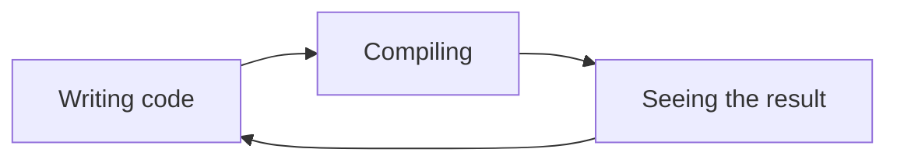



# Let's talk about Dev Ex

*Why are there so many 🎉 confettis laying on the floor?*

Dev Ex, or developer experience is the idea that software engineers need to invest some time into 
improving their work environment to be more productive in the long run.

Developer experience and developer productivity are two very intertwined concepts. You invest in the first to
improve the second.

Better productivity does not just mean shipping features faster. It also means happier developpers that spend more time
adding features than solving obscure issues.

In this article, I'll try to outline a few techniques and practices that tend to improve productivity.

## Reduce the duration of the feedback loop

What I call *the feedback loop* is the process:



This is what software engineer do a lot of the time. Write code, wait for deployment or compiling or any other automated step and see the result to know if what you did was correct.
By carefully planning and thinking about what you are doing, you can reduce the number of loops, but at some point, to understand a complex system like most software, you need to poke it and see how it reacts.

This means that reducing the time of this loop is crucial to be productive. The more experiments you can do, the more information you can gather about your system.

Concretely this means you need to put a lot of effort into:
- Reducing compile times
- Speeding up your CI
- Having live-reload

## Strong typing

The more I program, the more I realize the importance of types, and having types that describe accuratly all the states that a system is allowed to have.
Let's say you are writing an function takes a color as an argument. You want to be able to express that you need a color, "null" is not a color.

This is different from a function that can take a color as an argument, but does not need to.

```rust
pub fn set_color(c: Color){
    // ...
}

pub fn set_color_or_use_default(c: Option<Color>){
    // ...
}
```

I prefer language that allow you to express this find of distinction. Languages like Rust, Go, Typescript, Scala, Nim, or even to some extent Python with a type-checker.
This is also why I dislike languages like Javascript, Java or C.

Because you can communicate a lot of information to the reader just using a function signature, you are effectively writing self-enforcing documentation about your APIs.

This also makes the language more readable and improves your productivity. Instead of needing a full feedback loop to realize that you mistakenly passed an invalid argument to a function and get a runtime error, your text editor can instantly tell you something is wrong.

Sometimes, it's even better: as your are writing the incorrect code, Copilot suggests a correct alternative.

## Documentation

Documentation 📚 explains how your APIs work, what they do and why they do it. As code grows in complexity and team size increases, having a functional documentation becomes ever more important. Paradoxically, as the team grows, maintaining an up-to-date documentation becomes more challenging.

People forget it exists, and don't read or write it.

To alleviate this issue, keep developper the documentation as close to the code as possible.

This can mean Markdown files in your repository, documentation comments or storybooks.

- Your documentation becomes versionned.
- Changes can be reviewed like the rest of the code.
- Pull Requests can atomically update both code and documentation
- Documentation is as easy to access as code

You can also serve your documentation on a website using CI to build it and easily perform automations related to documentation.

Less time spent searching documentation and reading outdated information means more productivity and more enjoyable work.

## Having great error messages

When you write code, you sometimes need to deal with cases that "should never happen in practice". Depending on your language, there is probably a prefered way to deal with these cases, maybe
throwing an exception or returning an error, or something else.

Then such a case is eventually reached, maybe because an assumption you made changed or somebody used your API in an unintended way, you need to communicate clearly what happened, why it happened and what can be done to fix the issue. If you commonly encounter the same error, you need to put more effort into the error message.

<br>

Let's take an example. I was working on a server which needed to connect to a database at startup.
If I forgot to connect to my VPN, the server would be unable to contact the database, but a helpful "Cannot reach the database", it throw an exception in
an unrelated part of the code because of an object which normally came from the database being null.

<br>

This is behavior most people knew but it represented an extra piece of mental complexity to keep in mind. By simply throwing the error earlier with a good error message,
newcomers to the codebase get started quicker while more senior people need to remember less things.

## Writing Technical Plans

A technical plan is a rough idea of how to do a ticket.

Let's say you have a ticket that asks to add new button that throwns <button id="confetti_button">🎉 confettis 🎉</button> in your app.

<script src="https://cdn.jsdelivr.net/npm/canvas-confetti@1.9.3/dist/confetti.browser.min.js"></script>
<script>
    addEventListener("load", () => {
        document.getElementById("confetti_button").addEventListener("click", () => {
            confetti({
                particleCount: 100,
                spread: 70,
                origin: { y: 0.6 }
            });
        });
    });
</script>

If the ticket is assigned to a new developer, instead of just giving them the ticket, you can also write a few suggestions on where to start:

- In what file should the button be defined?
- Is there already a confetti throwing function in the codebase?
- If a library is needed, do you have recommendations?

This will reduce review time and help onboard the new developer to the code base by presenting the main entrypoints.
From their perspective, they will spend more time on the "happy path", writing the implementation instead of figuring out unrelated things.

## Conclusion

We've seen a few ways to improve the developer experience, but this list is in no way exhaustive. Some of the ideas I outline cannot be undertaken.
For example, changing programing languages midway through a project just for Dev Ex is a bad idea in general
and if it is, it is a sign of some other worse underlying problems.

Depending on your workplace, there can be many things that need improvement.

- Too many meetings
- Confusing parts of the code
- Poor general organisation

I hope this makes you think about how can enhance for workplace environment.

Do you have other ideas of how to make writing code spark more joy?
What are some things I missed or got wrong?

