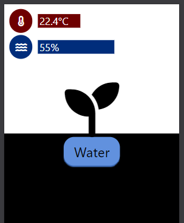


# Overengineering Gardening
*How an engineer takes care of a plant*

I recently got a plant at work. For it to survive, it needs to be watered about twice a week.
One day, a coworker came to me to tell me that my plant was dying from thirst, its leaves were all brown and dry.

I decided to do something, the life of a living being depended on me!

Of course, there was no way I would remember watering a plant multiple times a week. I could setup an alert using something
like a Slack or Telegram bot, which is what another coworker did.

This is the smart thing to do, but I wanted to overengineer this a little.

So I bought a pump and water humidity detector of Amazon, and searched at home for a ESP8622, an arduino, a breadboard and some wires.

## Requirements

Right at the start, I knew that I wanted to have some kind of [monitoring system](https://datadoghq.com) for this.
This meant that I also needed a true OS, so a raspberry PI was needed

Moreover, to be able to draw some cool graphs, I needed to gather some interesting data. I won't plot time over time!
So, I got a temperature sensor too.

## Assembly

I connected the raspberry to the ESP using a usb port.
I soldered all the sensors to the ESP (humidity and temperature) as well as the pump.

I had tested that everything worked before hand using a breadboard.

## Programming

Then, I wrote a bit firmware code on the ESP to send the sensor data back to the raspberry.
Back on the raspberry, I used a bit of Python to spin up a webserver to send the data and be able to control
the sensor through REST requests. I used FastAPI but it was a bit overblown as I did not need to generate an OpenAPI schema, I think Flask
would have been enough.

I was tempted to use a compiled programming language with no large runtime to install like Go, Rust or Nim but Python already had a serial library that worked
and was simple to import, so I went with that.

I then built a good looking frontend for my phone with a little Plant icon and I was good to go!

## Things I learned

1. Always take note of what cable does what and the roles of the PINs. It can save some time when changing the wiring.
2. When debugging, **first check that all the cables are properly connected** before checking every component one-by-one.
3. Always count the number of input and output ports on your chip to know how many sensor you'll be able to fit before starting a project.
4. When you have a frontend job, making good looking interfaces becomes easier.
5. Calibrating sensors takes some time and recalibration should be possible without needing to change the code.
6. Electronics is super cheap and fun. It gets 7/10 in the hobby rating scale. Waiting weeks for components to arrive from Amazon is annoying, so plan ahead!!
7. Transistors are magic, why buy a voltage converter when you can just use a transitor
8. When building electronic devices, **always have a LED** to know to indicate if the device is on or off!!!

When not using Arduino boards, you have to delve into the world of SDK and embedded real time OS. I used FreeRTOS which works pretty nice and
always me to compile my C code from Windows and Raspberry PI OS into the ESP, and to be able to use a real IDE and not the one provided by Arduino.

It takes a bit more time to install the build tools at first compared to Arduino, but the long term experience is in my opinion a bit better.
