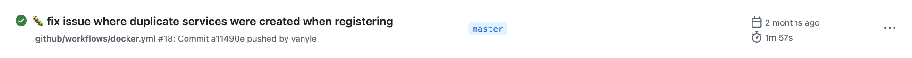



<script defer src="https://cdnjs.cloudflare.com/ajax/libs/highlight.js/11.5.1/languages/dockerfile.min.js"></script>

# Tiny Docker, Big Performance

*How to build apps that are quick to deploy to enhance your productivity*

I am a big believer in a quality developper experience. The faster you can iterate on a
solution, the better the solution you can come up with. Every tool that detects trivial bugs like typecheckers and linters are big time savers. And the less time you spend compiling, waiting around for CI and other tools, the more time you have to do interesting work.

After having spent time with Docker, experienced the gigabytes eaten for every image and the long minutes spent building containers only to find a failing step, I decided it was time to learn how to do Docker *the right way*.

## Choosing the right technologies

On my new project, [Aiguillage](https://github.com/vanyle/aiguillage), I knew I wanted to have the very best DevX possible as well as learn new tools. It is a very classic project with a frontend, a backend and a database. The backend mostly does CRUD request with the database.

I went with Go as it is able to build static executables without any dependencies.

What is nice with Go is that your Go code can serve the static assets as it is efficient, not like a Flask, Django or Rails backend, which simplifies your app as you can put everything in one container. 

For the database, to keep everything self-contained, I choose SQLite. We'll see later that it complicates things slightly but having one slim docker is still possible.

For the frontend, I used tried and tested technologies: React + Typescript + Tailwind. I tried [Bun](https://bun.sh/) as the bundler and package manager and was pleasantly surprised as it just worked without any work to do.

For the deployment, I wrote the Dockerfile in 3 steps: 
- Building the frontend
- Compiling the backend
- Putting it all together

Let me walk you through it.

## Writing the frontend part

First, I use the image provided by Bun to build the frontend

```dockerfile
FROM oven/bun:latest AS frontend-builder
```

Then, I put all the configuration files inside and install everything. The goal is to avoid reinstalling everything after making changes to the source.

```dockerfile
WORKDIR /web

COPY /web/package.json         \
     /web/bun.lockb            \
     /web/tsconfig.json        \
     /web/tsconfig.node.json   \
     /web/vite.config.ts       \
     /web/tsconfig.node.json   \
     /web/tailwind.config.js   \
     /web/postcss.config.js    \
     /web/.eslintrc.cjs .

RUN bun install
```

Finally, I do the actual build.

```dockerfile
COPY ./web/src src
COPY ./web/openapi openapi
COPY ./web/aiguillage.svg \
     ./web/index.html .


RUN bun run build
```

## The backend part!

For building the backend I went with an image with go installed. I used an alpine one as it is the smallest I found.

```dockerfile
FROM golang:alpine AS backend-builder
# Add gcc for cgo
RUN apk add build-base sqlite-libs sqlite-static
```

A little hint of things to come, I needed to install the libraries needed to compile sqlite as well as a C compiler.
Then, just like the frontend, I need to copy the configuration files first and install all dependencies.

```dockerfile
COPY go.mod go.sum .

RUN go mod download
RUN go mod verify
```

Finally, I can build the project, enabling all possible options of the Go compiler to make the executable as tiny as possible.
I also need to statically link against sqlite and put some other magic linker options.

This should be a reminder that [CGo is not Go](https://dave.cheney.net/2016/01/18/cgo-is-not-go). You lose some of the niceties of Go when you try CGo.

```dockerfile
COPY main.go .
COPY ./internal ./internal

RUN CGO_ENABLED=1 GOOS=linux GOARCH=amd64 go build -ldflags '-linkmode external -w -s -extldflags "-static -lm -ldl -lpthread -lsqlite3"' -o /aiguillage
```

## All together

Now that everything is built, we can create the true container that will run our app. It needs to contain as little as possible, so, we
start it from `scratch`.

```dockerfile
FROM scratch
```

I then set environment variables to indicate I'm in production and project specific variables.

```dockerfile
ENV GIN_MODE=release
ENV PROD=1
ENV PROXY=1
```

Finally, I copy the result of the builds of the previous steps into this container. I set the entrypoint and the exposed port of the image

```dockerfile
COPY --from=backend-builder /aiguillage /
COPY --from=frontend-builder /web/dist /serve
COPY ./db /db

EXPOSE 8080
ENTRYPOINT ["/aiguillage"]
```

## The result

We get an image with a size of 12.61 MB. This can look big, but remember, this is a self-contained image with a backend, frontend with all the assets and
libraries baked-in and a working database. It starts instantly and builds super quickly.

This makes for a great experience as when I want to deploy the image for testing after changing the code it all takes just 2 minutes in GitHub Actions.


So, what are the takeaways?

First, Go is great for medium size projects. The tooling as awesome, there are a lot of libraries availables and the performance is good. The biggest
shortcoming of Go is how interoperability for C libraries can be annoying, expecially, if, like me, you switch OS a lot (I use Windows, MacOS and Linux at least one a week).

Moreover, Go lacks expressivity and I'd prefer having a language like Typescript or Nim where I can represent errors like Option types rather than the constant idiom:

```go
if err != nil{
    return nil, err
}
```

However, I'd say Go is the best language we have for now for this. Every other language either requires a runtime (Java, Node, Python), has poor tooling (C++, Nim) or is infuriating to write and hard to prototype with (Rust). Maybe C# with .NET is the better but I haven't tried yet.

## References

As a reference, here is the full `Dockerfile`:

```dockerfile
FROM oven/bun:latest AS frontend-builder

WORKDIR /web

COPY /web/package.json         \
     /web/bun.lockb            \
     /web/tsconfig.json        \
     /web/tsconfig.node.json   \
     /web/vite.config.ts       \
     /web/tsconfig.node.json   \
     /web/tailwind.config.js   \
     /web/postcss.config.js    \
     /web/.eslintrc.cjs .


RUN bun install

COPY ./web/src src
COPY ./web/openapi openapi
COPY ./web/aiguillage.svg \
     ./web/index.html .


RUN bun run build

# ---------------------------------------------------
FROM golang:alpine AS backend-builder
# Add gcc for cgo
RUN apk add build-base sqlite-libs sqlite-static

WORKDIR $GOPATH/aiguillage

COPY go.mod go.sum .

RUN go mod download
RUN go mod verify

COPY main.go .
COPY ./internal ./internal

RUN CGO_ENABLED=1 GOOS=linux GOARCH=amd64 go build -ldflags '-linkmode external -w -s -extldflags "-static -lm -ldl -lpthread -lsqlite3"' -o /aiguillage

# ---------------------------------------------------
FROM scratch

ENV GIN_MODE=release
ENV PROD=1
# You can overwrite this to "false" or "or" to ignore the X-Real-Ip header.
ENV PROXY=1

COPY --from=backend-builder /aiguillage /
COPY --from=frontend-builder /web/dist /serve
COPY ./db /db

EXPOSE 8080
ENTRYPOINT ["/aiguillage"]
```

You can deploy Aiguillage yourself using this `docker-compose.yml`:

```yaml
services:
  aiguillage:
    image: ghcr.io/vanyle/aiguillage:latest
    ports:
      - "8080:8080"
```